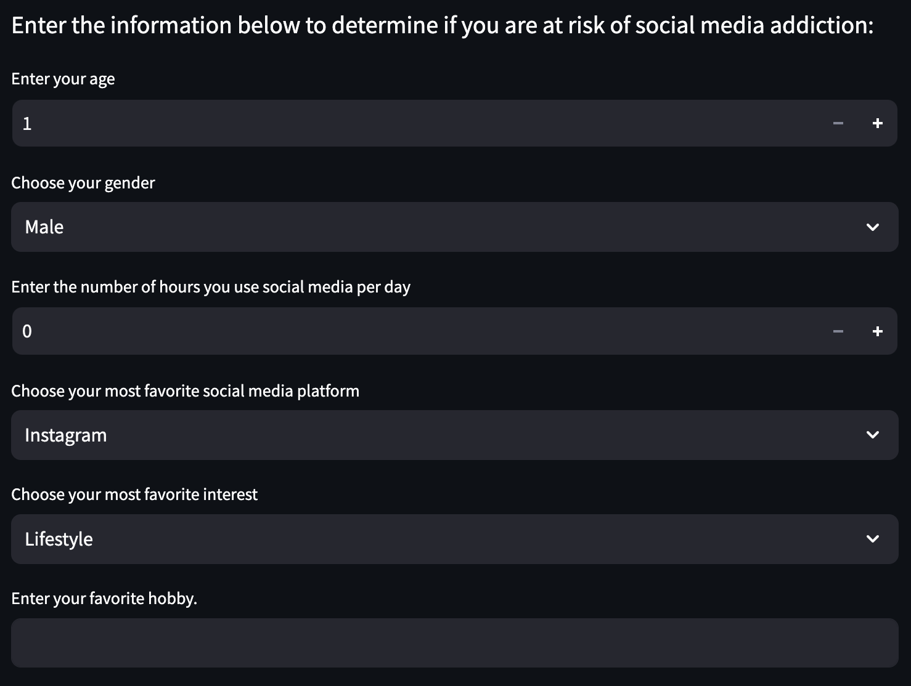
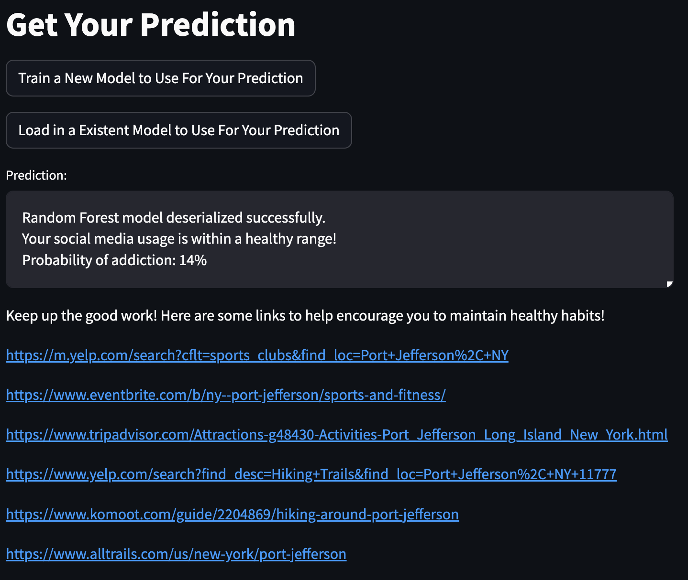
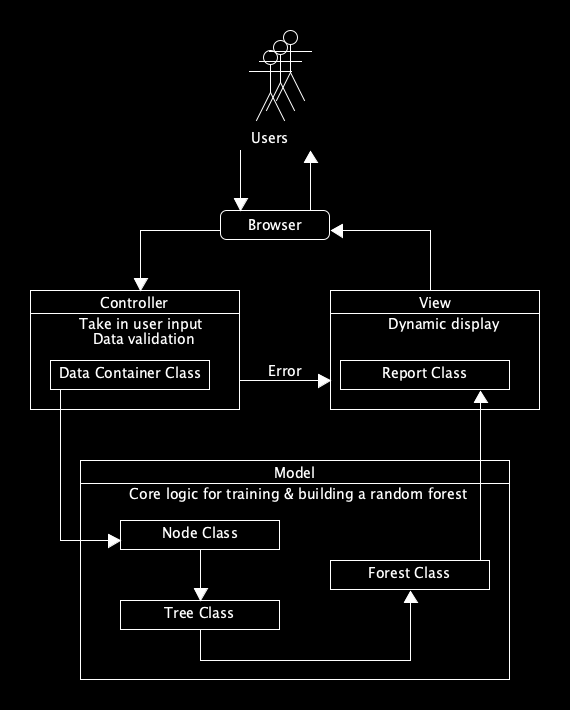
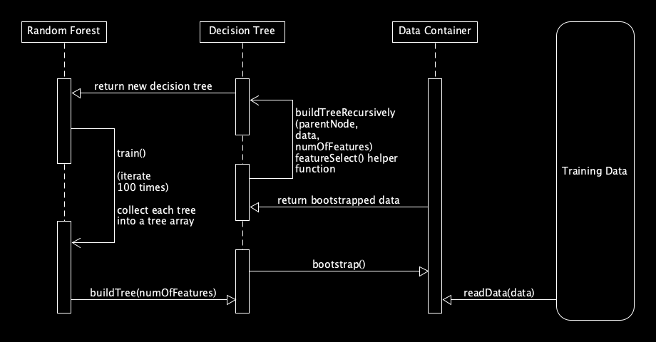
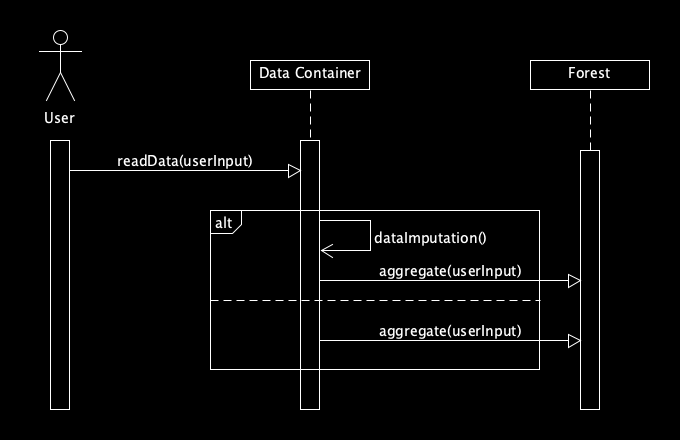
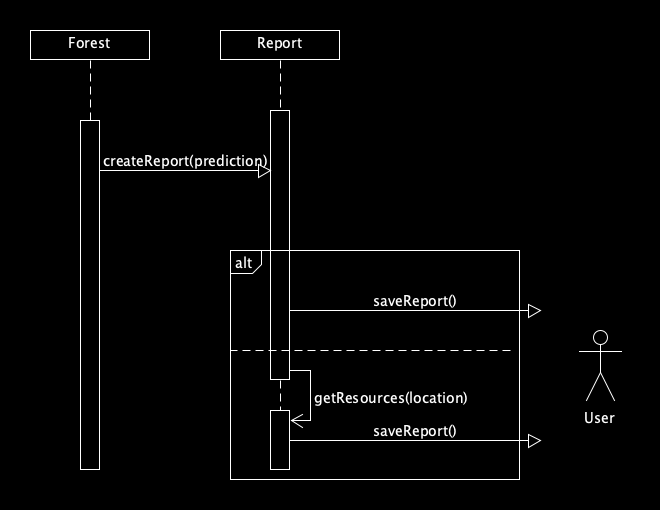

# Social Media Usage Predictor

## Usage and Interaction

the Social Media Usage Predictor is a web application that predicts social media addiction based on user-provided information, including social media habits and socioeconomic background.

You can try out the app live here: [Social Meia Usage Predictor App](https://social-media-usage-predictor.streamlit.app/)

## Introduction

In today’s age, social media consumption has been rapidly increasing as companies vie for user attention. This competition for user attention has caused social media companies to employ new features designed to retain users on their platform for longer. One recent example was the emergence of Tik-Tok, a social media platform that became popular for its main feature that plays short video clips with each swipe of the finger. This simple feature takes advantage of a user’s small attention span to try and keep them on the platform for longer. This feature was so effective that other companies such as Youtube and Instagram have implemented their own versions of this feature. As a result, social media consumption has skyrocketed and the absence of regulations in this area causes concern for a user’s well-being. 

This system is designed to combat these predatory features indirectly by providing the user with a prediction on how likely the user is to spend an excessive amount of time on social media. The system will also provide the user with customized recommendations and local resources so that the user can make informed decisions about their social media usage. Our system is specifically designed for individual users who wish to develop healthier habits. 

## Example Usage of Program

### User Interface:

The user begins by entering their information through a clean, intuitive user interface. Inputs can include social media habits, socioeconomic data, and other relevant fields required for prediction.

### Prediction Results:

After submitting input, the model processes the data and provides a prediction. In this case, the prediction will indicate the likelihood of social media addiction based on the user's data. The result is presented clearly, along with any additional insights or suggestions generated by the model.

## System and Random Forest Interaction Modeling Diagrams

### Model-View-Controller Pattern

The system follows the Model-View-Controller (MVC) pattern, which separates user interface and core model logic. The high level architectural design of the system is as follows:

### Training the Model

The Random Forest model was implemented in Java from scratch. The following sequence diagram outlines the classes involved and the training process on the dataset:

### Using the Model to Make a Prediction

Since the Model was trained on a data container object of the dataset, a new data container object is instantiated upon the user's input that is subsequently fed into the Forest for a prediction.

### Generating a Report Based on the Prediction:

Upon generating a prediction, the system creates a report for user review. 
 

